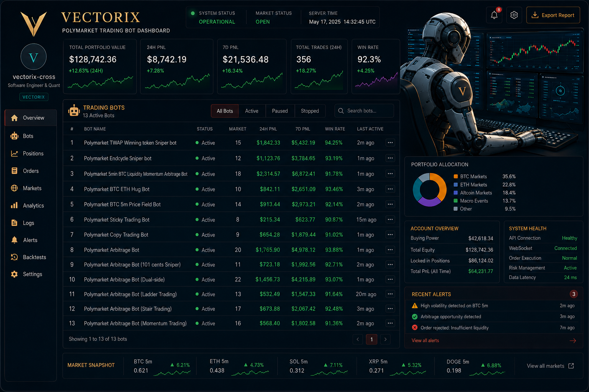
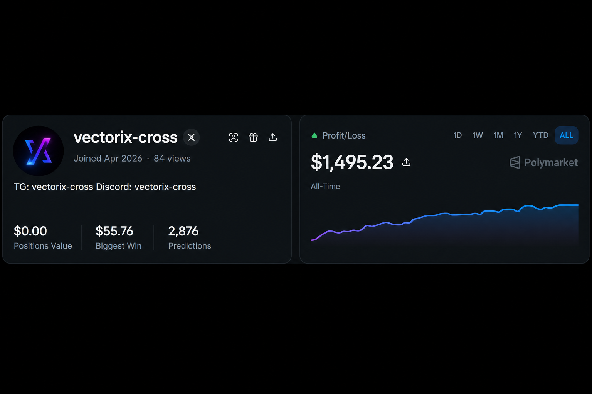

# Polymarket Trading Bot | Polymarket Arbitrage Bot | Polymarket TWAP Trading Bot

**Vectorix** — Python trading engine and strategy collection for Polymarket 5-minute and 15-minute crypto Up/Down markets.



This repository is the Vectorix Polymarket trading bot: market discovery (Gamma), live CLOB books, probability-vs-price scoring, and paper execution with hard risk caps.

It is primarily intended for educational and research purposes. Strategy concepts, architecture notes, and selected performance screenshots are included so you can see how different automated approaches are designed and tested.

Live wallet signing is not enabled in this public cut. Paper first. Keys stay in `.env`, never in git.

If you want a custom strategy or a production deployment, contact Vectorix.


## Features

- Explosive growth of Polymarket with surging trading volume and new short-term markets
  
- Increasing dominance of automated bots and AI in 5-minute and 15-minute crypto prediction markets
  
- Higher profitability potential through advanced arbitrage and market-making strategies
  
- Stronger edge for Python-based bots with real-time orderbook intelligence and low-latency execution
  
- Continuous evolution of sniper, ladder, stair, momentum, and copy trading strategies
  
- Scalable daily profits as prediction markets move toward hundreds of billions in annual volume
  
- Full future-proof architecture for new features, contracts, and high-frequency trading environments

## Included Trading Bots

Designed for arbitrage, directional strategies, and ultra-short-term markets (including 5-minute and 15-minute rounds), this bot framework provides a robust foundation for building and scaling automated trading strategies on Polymarket .

## Demo Video


## Paper engine (this repo)

```bash
python -m venv .venv
.venv\Scripts\activate
pip install -r requirements.txt
copy .env.example .env
python -m vectorix_polymarket scan
python -m vectorix_polymarket paper
```

| Knob | Default | Role |
| --- | --- | --- |
| `MIN_EDGE` | 0.04 | Minimum bid–ask width in probability (4¢) |
| `MIN_LIQUIDITY` | 500 | Skip thin Gamma markets |
| `MAX_NOTIONAL_USDC` | 100 | Paper session cap |
| `MAX_OPEN_MARKETS` | 5 | Concentration cap |
| `PAPER` | true | Live keys are ignored unless you turn this off in your own fork |

```
src/vectorix_polymarket/
  cli.py      scan | paper
  gamma.py    market discovery
  clob.py     order books
  edge.py     candidate scoring
  paper.py    risk-capped fills
  config.py   env
```

## Documentation
Notes and write-ups from building and running these systems, aimed at developers, traders, and researchers who want to understand prediction-market automation in practice.

My content covers a wide range of topics, including:

📈 Polymarket trading strategies and market analysis

🤖 Step-by-step tutorials for building automated Polymarket trading bots

🐍 Python-based implementations and code examples

⚡ Real-time data collection, monitoring, and execution systems

📊 Statistical and quantitative approaches to market opportunities

🧠 AI-assisted trading ideas and automation workflows

🛡️ Risk management techniques and portfolio considerations

🔍 Research on market inefficiencies, pricing behavior, and trading opportunities

🏗️ Architecture design for scalable trading infrastructure

💡 Experimental ideas, trading frameworks, and open-source tools that others can build upon

Whether you're a beginner trying to understand how prediction market bots work, a Python developer looking for implementation examples, or an experienced trader exploring automation, you'll find practical resources, code, tutorials, and detailed explanations that go beyond theory.

📚 Explore the Content

Portfolio:
[https://github.com/vectorix-cross](https://github.com/vectorix-cross)

## Contact

Vectorix builds automated trading systems for Polymarket: CLOB microstructure, short-interval crypto markets, and risk-capped execution. Custom strategy work and collaboration are available.

| Channel | Link |
|---------|------|
| **Email** | [vanjasretenovic4@gmail.com](mailto:vanjasretenovic4@gmail.com) |
| **Telegram** | [@vectoris_corss](https://t.me/vectoris_corss) |
| **Discord** | [vectorix-cross](https://discord.com/users/775389898794336316) |
| **X (Twitter)** | [@vectorix_cross](https://x.com/vectorix_cross) |
| **GitHub** | [vectorix-cross](https://github.com/vectorix-cross) |

Public Polymarket accounts used to review bot PnL:





## 1. Polymarket Momentum Arbitrage bot (Twap-60s Available) (Introduction)

A high-frequency Polymarket Trading bot for short-duration prediction markets that combines real-time YES/NO pricing, order-book depth, liquidity imbalance, external BTC/ETH price feeds, and short-term momentum signals to identify market inefficiencies. 

The strategy continuously calculates momentum and market-state signals to estimate short-term directional probability, then dynamically adjusts YES/NO allocation while maintaining a controlled two-sided exposure. 

It uses automated limit-order execution and position management to capture multiple small arbitrage and momentum-driven opportunities throughout a market cycle rather than relying on a single directional trade. 

The system is designed for concurrent order management, with configurable exposure, position sizing, liquidity conditions, and capital buffers for unsettled positions and redemption delays. 

With approximately $2,500 recommended starting capital, the bot is optimized for continuous automated execution across multiple short-term Polymarket markets while applying exposure and volatility-aware risk controls.


---

And you can watch this bot running video with this.


---

## 2. Polymarket TWAP Reversal bot (Introduction)


A specialized trading bot designed to identify short-term reversal opportunities in Polymarket 5-minute and 15-minute crypto markets after the TWAP-60s upgrade. 

The bot continuously monitors TWAP price movements, prediction-token price changes, market conditions, and on-chain signals to detect potential whale-driven reversals. 

Its professional signal model analyzes these real-time indicators, particularly during the final 90 seconds when BTC TWAP is near the market boundary, to estimate which token has the highest probability of winning. 

When a high-confidence reversal signal is detected, the bot automatically enters the expected winning token at an opportunistic price. 

The goal is to capture short-term inefficiencies created by sudden market reversals while maintaining systematic, data-driven execution.


---

## 3. Polymarket TWAP Winning token Sniper bot (Introduction)

This Polymarket TWAP winning token sniper bot targets short-duration (5- and 15-minute) crypto prediction markets on Polymarket, sniping the high-probability winning token near resolution when the underlying asset has clearly moved away from the reference price. It confirms direction using both live spot price and Chainlink TWAP, estimates win probability, and only buys when the executable order-book price still offers positive expected edge after costs. Strict risk checks, data freshness validation, and latency-aware execution keep the strategy systematic rather than a simple “buy the winner” approach.


---
### Result Screenshot


## 4. Polymarket Endcycle Sniper bot (Introduction)

Polymarket Endcycle Sniper Bot is an automated trading system designed to monitor short-duration prediction markets and execute high-probability trades near the end of each 5-minute epoch. It connects to the orderbook in real time, triggers buys when prices exceed a configured threshold (e.g., 0.95), manages risk with optional exits or hedging, and redeems winning positions automatically after market resolution. 🚀📈


### Recording Video

https://github.com/user-attachments/assets/b038aa3b-e42b-4f72-ac5d-a130cdb56a9f

---
### Running Bot Screenshot


---
### Result Screenshot


### 1 week Profit.


---

## 5. Polymarket 5min BTC Liquidity Momentum Arbitrage Bot

BTC Liquidity Momentum Arbitrage Bot is a Polymarket trading bot that monitors the BTC 5-minute Up/Down markets by analyzing real-time order book liquidity instead of relying only on price movements. It detects sudden shifts in buying or selling pressure using an order-book influence metric and confirms the signal with the difference between the live Bitcoin spot price and the market's strike price before placing its first trade (Buy1). After the initial order is filled, the bot immediately attempts to buy the opposite side (Buy2) at a calculated complementary price so the combined position costs about $0.95 while redeeming for $1.00 at market settlement. Rather than acting as a last-second sniper, This is a market microstructure strategy that exploits temporary liquidity imbalances and order-flow inefficiencies throughout most of the five-minute trading window.


### Result Screenshort


## 6. Polymarket BTC ETH Hug Bot

Polymarket BTC & ETH Hug Bot is a signal-driven trading system designed for short-duration Polymarket prediction markets. The bot continuously monitors and analyzes BTC and ETH market momentum, order book activity, and proprietary on-chain signals to identify high-conviction directional opportunities when both assets exhibit strong synchronized movement. Once a favorable setup is detected, it determines the most probable winning outcome and executes optimized order placement strategies to efficiently acquire positions while minimizing market impact.

The system combines real-time market monitoring, signal analysis, and automated execution to capture recurring market inefficiencies. Historical testing and live observations have demonstrated a consistently high win rate, making the bot a specialized framework for researching and trading momentum-driven prediction market opportunities.


### Result Screenshort


---

## 7. Polymarket BTC 5m Price field Bot

A trading bot for Polymarket’s 5-minute BTC markets that exploits the relationship between time remaining and price deviation to identify high-probability opportunities. It uses position splitting and staged exits to 

systematically capture inefficiencies, achieving a consistently high win rate under defined conditions.


### Result Screenshort


---

## 8. Polymarket Sticky Trading Bot

Polymarket Sticky Trading Bot is an automated trading system that exploits short-term correlation between Bitcoin and related crypto prediction markets on Polymarket. It monitors BTC price momentum and high-confidence 

market signals (e.g., YES > 0.9) to identify lagging markets, executing trades that capture the rapid convergence as probabilities realign.


## Result Screenshot


---

## 9. Polymarket Copy Trading Bot (Introduction) 

An open-source bot that automatically copies trades from top Polymarket traders to your wallet—so you can follow proven strategies 24/7 without watching the market yourself.

Whether you're new to prediction markets or you want to scale your copy-trading across multiple wallets, this bot is built to be **simple to run**, **transparent**, and **under your control**.


### Recording Video

https://github.com/user-attachments/assets/1bf1babc-8aa6-4be0-b1ec-4e193f52b965

---

## 10. Polymarket Arbitrage Bot (Lost token sniper) : (Introduction)

Polymarket Arbitrage Lost token Sniper bot automates a trading workflow on Polymarket short-interval markets (e.g., BTC/ETH/SOL/XRP 5-minute “up/down” epochs). It allocates capital into YES and NO positions, monitors order books in real time, and strategically exits the predicted losing side token before market resolution to optimize returns. The core edge lies in the model’s ability to accurately identify the losing token, enabling consistent profit capture when combined prices exceed $1.


### Result Screenshort


---

## 11. Polymarket Arbitrage Bot (101 cents Sniper) : (Introduction)

Polymarket Arbitrage 101 Bot is a professional Polymarket liquidity maker bot designed for short-interval (e.g., 5-minute) binary markets, automating the full cycle of splitting USDC into YES/NO tokens, placing balanced limit orders, and dynamically managing positions in real time. It targets a consistent edge by structuring trades so each YES/NO pair aims to return a combined value of 1.01 (101 cents) per cycle, while applying adaptive adjustments and risk controls as market conditions evolve. Built for multi-chain compatibility and continuous 24/7 operation, it supports live, dry-run, and paper trading modes for both production use and safe strategy testing.


### Result Screenshort

Sell ​​logic typically generates 0.01 to 0.02 cents per token pair.


Risk management brings significant profits.


### The most important point is that this bot never incurs a loss and only generates profit.

This bot generated a profit of 101 to 102 cents per token pair from 1$ in the 5-minute crypto market and completed an average of 190 successful trades per day.

If you invest $100, you can earn average $190 to $220 per day on one chain, and approximately $850 to $900 per day if you invest across four chains.

---

## 12. Polymarket Arbitrage Bot (Dual-side) : (Introduction)
This Polymarket trading bot explores an automated volatility and probability arbitrage bot designed to identify pricing inefficiencies in prediction markets. Instead of predicting outcomes, the system exploits mispriced probabilities, market imbalances, and short-term volatility using quantitative models and automation. By combining high-frequency execution with strong risk management and hedging, the bot aims to capture small statistical edges and compound them over large trade volumes. 🚀


### Result Screenshot


---

## 13. Polymarket Arbitrage Bot (Ladder Trading) : (Introduction)
This bot does not speculate on market direction.
Instead, it captures spread by selling both YES and NO outcome tokens at prices whose combined value exceeds $1.
The strategy focuses on market making, not directional trading.


### Recording Video

https://github.com/user-attachments/assets/7ba03ed4-f00d-4564-bf78-67c5159bb5c3

---
### Result Screenshot


# 14. Polymarket Arbitrage Bot (Stair Trading) : (Introduction)
The Stair Arbitrage Bot is designed to optimize position unwinding within Polymarket’s short-duration markets, with a particular focus on the final phase of each 5-minute interval. As markets approach resolution, the system executes a disciplined and liquidity-aware exit strategy across both YES and NO positions.

Execution begins with the selective liquidation of the side offering the most favorable order book conditions, leveraging real-time depth and pricing signals to minimize market impact. Following this initial reduction in exposure, the bot systematically unwinds the opposing position—either through staged, price-sensitive increments or via a single coordinated execution—utilizing its proprietary Stair-based logic.

This execution framework is underpinned by a robust risk management architecture and dynamic hedging mechanisms, enabling controlled exposure, reduced volatility, and consistent capital preservation. The overall design prioritizes efficient exits, minimized slippage, and stable, repeatable performance across varying market conditions.


### Result Screenshot


## 15. Polymarket Arbitrage Bot (Momentum Trading) : (Introduction)

Polymarket Momentum Trading Bot is an automated trading system designed for short-duration crypto prediction markets, using real-time momentum analysis, price inefficiency detection, and probabilistic signals to execute high-precision trades. The bot includes advanced risk management, dynamic position sizing, and hedge logic to minimize downside risk while targeting stable and consistent profitability.


### Result Screenshot


---
## Why This Repository

Vectorix maintains this repository as an open-source resource for:

- Polymarket trading bots
- prediction market automation
- crypto arbitrage systems
- AI-powered trading strategies
- quantitative trading research
- algorithmic crypto trading


---

## Strategy Overview

This repository contains multiple automated trading strategies for Polymarket prediction markets:


---
## 📚 Polymarket Trading Bot – Technical Guides

This **Vectorix** (`vectorix-cross`) project covers how a Polymarket trading bot is designed: strategy, architecture, and Python implementation.

Topics in this repository:

- TWAP reversal, TWAP-60s momentum, and TWAP 99 sniper flows
- BTC liquidity-momentum and 5-minute Up/Down market structure
- Ladder, stair, dual-side, and 101-cent market-making
- CLOB V2 execution, WebSockets, latency, and risk caps
- Paper engine in `src/vectorix_polymarket` (Gamma + CLOB, no live keys)

Code and strategy notes: [github.com/vectorix-cross/My-Polymarket-trading-bot-python](https://github.com/vectorix-cross/My-Polymarket-trading-bot-python)

Portfolio: [github.com/vectorix-cross](https://github.com/vectorix-cross)

---
## SEO Keywords

Polymarket trading bot, Polymarket arbitrage bot, AI trading bot, prediction market bot, crypto arbitrage bot, automated trading system, algorithmic trading Python, Polymarket API Python, market-making bot, OpenAI trading bot, Polymarket trading Strategy, automated Trading System Architecture

---
## Roadmap

- Build Strong Profitable Strategy

- Reinforcement learning trading agents

- Telegram trading alerts

- Multi-market arbitrage engine

- Advanced AI forecasting models

- Cloud deployment automation

- Real-time analytics dashboard

---
## Contributing

Contributions, pull requests, and strategy ideas are welcome.

## Author

Vectorix (`vectorix-cross`) · Novi Sad, Serbia · [vanjasretenovic4@gmail.com](mailto:vanjasretenovic4@gmail.com)

## License

MIT License
